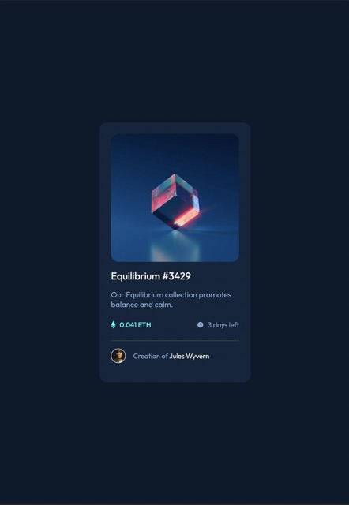

# NFT preview card component solution

This is a solution to the [NFT preview card component challenge on Frontend Mentor](https://www.frontendmentor.io/challenges/nft-preview-card-component-SbdUL_w0U). Frontend Mentor challenges help you improve your coding skills by building realistic projects.

## Table of contents

- [Overview](#overview)
  - [The challenge](#the-challenge)
  - [Links](#links)
- [My process](#my-process)
  - [Built with](#built-with)
  - [What I learned](#what-i-learned)
- [Author](#author)

## Overview

### The challenge

Users should be able to:

- View the optimal layout depending on their device's screen size
- See hover states for interactive elements

### Links

- Solution URL: [www.Fronendmentor.io](https://www.frontendmentor.io/challenges/nft-preview-card-component-SbdUL_w0U/hub/nft-preview-card-component-solution-OU5X50YbQz)
- Live Site URL: [Review in Netify](https://splendorous-zabaione-013ecb.netlify.app)

## My process

### Built with

- Semantic HTML5 markup
- CSS
- SASS
- Flexbox
- **Mobile-first workflow**

### What I learned

The tricki about this one was the green layer over the picture, and the little eye icon over it.
All the proyect was made in 30~45 min. but I struggle for about 2 hours whith the hover property and the green layer requierement.

This was my first solo flight with SASS and it was fun! I love how SASS structures the code, the process just fits perfectly with my mind. When I review the CSS file, I recognize that it would be a headache to work

## Author

- Website - [crRoG](https://crRoG.com)
- Frontend Mentor - [@crRog](https://www.frontendmentor.io/home)
- Twitter - [@crRoG](https://www.twitter.com/crRoG)

### Screenshot

